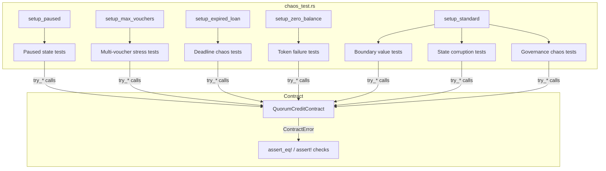

# Design Document: Chaos Engineering Tests

## Overview

Chaos engineering tests verify that the QuorumCredit contract fails safely and predictably under adversarial and edge-case conditions. No contract logic changes — this is a purely additive test module (`src/chaos_test.rs`) that exercises every failure path: zero/boundary inputs, state corruption attempts, paused-state blocking, token failures, deadline boundary conditions, multi-voucher stress, and governance chaos.

## Architecture



All tests use `try_*` client methods (e.g. `client.try_vouch(...)`) which return `Result<_, _>` rather than panicking, allowing assertion of specific error variants.

## Components and Interfaces

### `src/chaos_test.rs` — Chaos Test Module

```rust
#[cfg(test)]
mod chaos_test {
    use super::*;
    use soroban_sdk::{testutils::{Address as _, Ledger}, Env};

    // ── Setup helpers ─────────────────────────────────────────────────────────

    /// Standard setup: initialised contract, funded voucher, no active loan.
    fn setup_standard(env: &Env) -> ChaosFixture { /* ... */ }

    /// Paused setup: contract initialised and immediately paused.
    fn setup_paused(env: &Env) -> ChaosFixture { /* ... */ }

    /// Max-voucher setup: borrower has DEFAULT_MAX_VOUCHERS_PER_BORROWER vouches.
    fn setup_max_vouchers(env: &Env) -> ChaosFixture { /* ... */ }

    /// Expired-loan setup: active loan with deadline in the past.
    fn setup_expired_loan(env: &Env) -> ChaosFixture { /* ... */ }

    /// Zero-balance setup: voucher has zero token balance.
    fn setup_zero_balance(env: &Env) -> ChaosFixture { /* ... */ }

    struct ChaosFixture {
        contract_id: Address,
        token_addr: Address,
        admin: Address,
        borrower: Address,
        voucher: Address,
    }
}
```

### Error variant assertions

Each test uses `assert_eq!(result, Err(Ok(ContractError::XYZ)))` — the pattern used throughout the existing test suite for `try_*` calls that return `Result<Result<T, ContractError>, _>`.

### Ledger timestamp manipulation

Deadline chaos tests use `env.ledger().set_timestamp(loan.deadline + 1)` to simulate time advancing past the deadline, consistent with the pattern in `test_auto_slash_after_deadline`.

## Data Models

No new storage keys or data structures. All chaos tests operate on the existing `DataKey`, `LoanRecord`, `VouchRecord`, and `Config` types.

## Correctness Properties

### Property 1: No unexpected panics

For any input combination covered by the chaos test suite, the contract SHALL either return a typed `ContractError` or succeed — it SHALL NOT produce an unhandled panic, integer overflow, or `unwrap` failure.

**Validates: Requirements 1.5, 1.6, 1.7, 6.5**

### Property 2: Atomic state transitions

For any function call that returns a `ContractError`, the contract storage SHALL be identical before and after the call. No partial writes are permitted.

**Validates: Requirements 1.1, 1.2, 2.1, 2.4, 4.2, 4.3, 4.4**

### Property 3: Paused state completeness

When `DataKey::Paused` is `true`, every write function SHALL return `ContractError::ContractPaused` without reading or writing any other storage key.

**Validates: Requirements 3.1, 3.2, 3.3, 3.4, 3.5**

### Property 4: Deadline boundary exactness

`auto_slash` SHALL execute at `timestamp == deadline` and `repay` SHALL succeed at `timestamp == deadline`. The boundary is inclusive for repay and inclusive for auto_slash.

**Validates: Requirements 5.1, 5.2, 5.3**

### Property 5: Idempotent error responses

Calling a function that returns a `ContractError` a second time with the same inputs SHALL return the same error. The contract SHALL NOT change its error response based on how many times a failing call has been attempted.

**Validates: Requirements 2.2, 2.3, 4.4, 5.4, 5.5**

## Error Handling

| Chaos Scenario | Expected Error |
|---|---|
| `vouch` with zero stake | `ContractError::InvalidAmount` |
| `request_loan` with zero amount | `ContractError::InvalidAmount` |
| `request_loan` below min amount | `ContractError::LoanBelowMinAmount` |
| `vouch` duplicate | `ContractError::DuplicateVouch` |
| `repay` on repaid loan | `ContractError::NoActiveLoan` |
| `repay` on defaulted loan | `ContractError::NoActiveLoan` |
| Any write while paused | `ContractError::ContractPaused` |
| Invalid token | `ContractError::InvalidToken` |
| Insufficient contract balance | `ContractError::InsufficientFunds` |
| `repay` past deadline | `ContractError::LoanPastDeadline` |
| `auto_slash` before deadline | panic: "loan deadline has not passed" |
| `auto_slash` on repaid loan | `ContractError::NoActiveLoan` |
| Max vouchers exceeded | `ContractError::MaxVouchersPerBorrowerExceeded` |
| `vote_slash` with zero stake | `ContractError::InsufficientFunds` or `ContractError::NotGovernanceParticipant` |
| `vote_slash` duplicate | `ContractError::AlreadyVoted` |

## Testing Strategy

### Module structure

`src/chaos_test.rs` is organised into sections matching the seven requirement categories, each with a section comment. Each test function includes a comment identifying its chaos category and the requirement it validates.

### Test naming convention

`test_chaos_<category>_<scenario>` — e.g. `test_chaos_boundary_zero_stake`, `test_chaos_paused_vouch_blocked`, `test_chaos_deadline_repay_at_exact_deadline`.

### Reusable helpers

Five setup helpers (`setup_standard`, `setup_paused`, `setup_max_vouchers`, `setup_expired_loan`, `setup_zero_balance`) eliminate duplicated env/contract/token initialisation across the ~35 test functions.

### Coverage target

At least one test per acceptance criterion across Requirements 1–7, totalling a minimum of 35 test functions.
