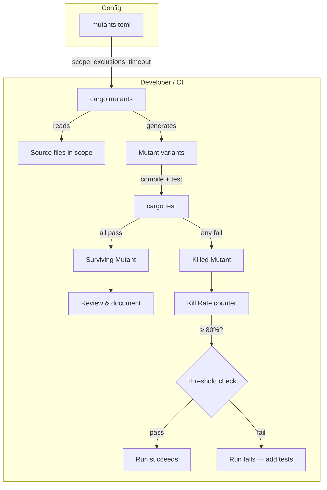

# Design Document: Mutation Testing

## Overview

Mutation testing verifies the quality of the QuorumCredit test suite by systematically injecting small, syntactically valid changes (mutations) into the contract source code and checking whether the existing tests detect each change. The tool used is [`cargo-mutants`](https://mutants.rs), the de-facto standard mutation testing framework for Rust projects.

The feature is purely a developer-tooling addition: no contract logic, storage layout, or public API changes. The deliverables are a `mutants.toml` configuration file, a `docs/mutation-testing.md` baseline report, and an optional CI job.

The primary quality gate is a **Kill Rate ≥ 80%**: at least 80% of generated mutants must be killed by the existing test suite. Surviving mutants are reviewed and either addressed with new tests or explicitly accepted and excluded.

## Architecture

`cargo-mutants` operates entirely outside the contract runtime. It reads the project source, generates mutated copies, compiles each copy, runs the full test suite against it, and reports which mutants were killed (at least one test failed) versus survived (all tests passed).



The test suite evaluated by `cargo-mutants` includes all seven existing test modules:

- `slash_threshold_voting_test`
- `slash_cooldown_test`
- `config_update_voting_test`
- `emergency_pause_test`
- `withdrawal_queue_test`
- `cross_chain_vouch_test`
- `property_stake_loan_invariants_test`

## Components and Interfaces

### `mutants.toml` — Mutation Configuration

Located at the repository root. Controls which files are mutated, per-mutant timeout, and exclusion rules.

```toml
# mutants.toml

# Per-mutant test timeout in seconds. Soroban tests are fast; 60 s is generous.
timeout = 60

# Source files included in the mutation scope.
# Only these files will have mutants generated.
include_globs = [
    "src/lib.rs",
    "src/vouch.rs",
    "src/governance.rs",
    "src/admin.rs",
    "src/helpers.rs",
]

# Exclude test modules, build scripts, and generated code.
exclude_globs = [
    "src/*_test.rs",
    "src/tests/**",
    "build.rs",
]

# Functions to skip (e.g. trivial getters, pure logging).
# Add entries here when a surviving mutant is accepted as low-risk.
# Example:
# [[exclude_functions]]
# name = "get_version"
# reason = "Version string is cosmetic; no test coverage required."
```

### `docs/mutation-testing.md` — Baseline Report

A human-readable document recording the baseline Kill Rate, surviving mutants, and remediation decisions. Updated after every run that changes the Kill Rate by more than 2 percentage points.

### CI Job (optional) — `.github/workflows/mutation-testing.yml`

A GitHub Actions workflow that runs `cargo mutants` on pull requests and main-branch pushes, fails if Kill Rate < 80%, and caches compiled artefacts.

```yaml
# .github/workflows/mutation-testing.yml (sketch)
name: Mutation Testing
on:
  pull_request:
    branches: [main]
  push:
    branches: [main]

jobs:
  mutants:
    runs-on: ubuntu-latest
    timeout-minutes: 30
    steps:
      - uses: actions/checkout@v4
      - uses: dtolnay/rust-toolchain@stable
      - uses: Swatinem/rust-cache@v2
      - name: Install cargo-mutants
        run: cargo install cargo-mutants --locked
      - name: Run mutation testing
        run: cargo mutants --timeout 60 -- --test-threads 4
      - name: Check kill rate
        run: |
          python3 scripts/check_kill_rate.py mutants.out/outcomes.json 80
```

### `scripts/check_kill_rate.py` — Kill Rate Assertion Script

A small Python script that parses `cargo-mutants` JSON output and exits non-zero if the Kill Rate is below the threshold.

```python
#!/usr/bin/env python3
"""Assert that the cargo-mutants kill rate meets the minimum threshold."""
import json, sys

outcomes_path, threshold = sys.argv[1], int(sys.argv[2])
data = json.load(open(outcomes_path))
total = data["total_mutants"]
killed = data["killed"]
if total == 0:
    print("No mutants generated — check scope configuration.")
    sys.exit(1)
kill_rate = killed / total * 100
print(f"Kill rate: {kill_rate:.1f}% ({killed}/{total})")
if kill_rate < threshold:
    print(f"FAIL: kill rate {kill_rate:.1f}% is below threshold {threshold}%")
    sys.exit(1)
print("PASS")
```

## Data Models

No contract storage or on-chain data is affected. The relevant data structures are all off-chain artefacts produced by `cargo-mutants`.

| Artefact | Location | Description |
|---|---|---|
| `mutants.toml` | repo root | Scope and timeout configuration for `cargo-mutants` |
| `mutants.out/` | repo root (gitignored) | Per-run output directory: logs, outcomes JSON, mutant diffs |
| `mutants.out/outcomes.json` | inside `mutants.out/` | Machine-readable summary: total, killed, survived, timeouts |
| `docs/mutation-testing.md` | `docs/` | Human-readable baseline report and surviving-mutant log |

### `outcomes.json` schema (cargo-mutants output)

```json
{
  "total_mutants": 142,
  "killed": 118,
  "survived": 19,
  "timeout": 5,
  "cargo_mutants_version": "24.x.x"
}
```

### Mutation Operators Applied by cargo-mutants

`cargo-mutants` applies the following classes of mutation operators to Rust source:

| Operator class | Example original | Example mutant |
|---|---|---|
| Arithmetic replacement | `a + b` | `a - b`, `a * b` |
| Comparison replacement | `a > b` | `a >= b`, `a < b`, `a == b` |
| Logical operator swap | `a && b` | `a \|\| b` |
| Return value replacement | `return x;` | `return Default::default();` |
| Boolean literal flip | `true` | `false` |
| Integer literal change | `return 10;` | `return 0;`, `return 1;` |
| Early return injection | _(body)_ | `return Ok(Default::default());` |

These operators target the most common classes of logic bugs in smart contract code: off-by-one errors, wrong comparison direction, incorrect arithmetic, and missing guard conditions.

## Correctness Properties

*A property is a characteristic or behavior that should hold true across all valid executions of a system — essentially, a formal statement about what the system should do. Properties serve as the bridge between human-readable specifications and machine-verifiable correctness guarantees.*

### Property 1: Kill Rate meets threshold

*For any* mutation testing run against the defined scope, the Kill Rate SHALL be ≥ 80%. A run that produces a Kill Rate below this value indicates a gap in the test suite that must be addressed before the run is considered passing.

**Validates: Requirements 3.2, 3.3**

### Property 2: Scope completeness

*For any* source file listed in `mutants.toml` `include_globs`, `cargo mutants --list` SHALL enumerate at least one mutant from that file. A file with zero mutants indicates either an empty file or an incorrect glob pattern.

**Validates: Requirements 2.1, 2.3**

### Property 3: Scope exclusion

*For any* file matching `exclude_globs` in `mutants.toml`, `cargo mutants --list` SHALL NOT enumerate any mutants from that file. Test modules must never appear in the mutant list.

**Validates: Requirements 2.2, 2.3**

### Property 4: Surviving mutant documentation completeness

*For any* surviving mutant reported in `mutants.out/outcomes.json`, the `docs/mutation-testing.md` document SHALL contain a corresponding entry with file, line, original code, mutated code, and remediation decision.

**Validates: Requirements 5.1, 5.2**

### Property 5: Timeout safety

*For any* mutant that causes the test suite to hang, `cargo-mutants` SHALL terminate the test run after the configured timeout (60 seconds) and record the mutant as a timeout rather than a survivor. Timeout mutants SHALL NOT count toward the Kill Rate denominator.

**Validates: Requirements 1.5, 4.5**

## Error Handling

| Scenario | Behaviour |
|---|---|
| `cargo-mutants` not installed | `cargo mutants` exits with a clear error; developer runs `cargo install cargo-mutants` |
| Compilation failure on a mutant | `cargo-mutants` records the mutant as "unviable" and excludes it from Kill Rate calculation |
| Test suite hangs on a mutant | `cargo-mutants` kills the process after `timeout` seconds and records a timeout |
| Zero mutants generated | `check_kill_rate.py` exits non-zero with a scope configuration warning |
| Kill Rate below threshold | CI job fails; developer reviews `mutants.out/` and adds targeted tests |
| `mutants.out/` missing in CI | CI step fails with a file-not-found error; developer checks `cargo mutants` exit code |

## Testing Strategy

Mutation testing is itself a meta-testing activity — it tests the tests. The verification strategy therefore focuses on the tooling and configuration rather than on new contract tests.

### Verification steps

1. **Dry run**: Run `cargo mutants --list` to confirm the scope matches the intended files and that no test modules appear.
2. **Baseline run**: Run `cargo mutants` to completion and record the Kill Rate in `docs/mutation-testing.md`.
3. **Threshold check**: Confirm the Kill Rate is ≥ 80%. If not, identify the surviving mutants with the highest impact and write targeted tests.
4. **Surviving mutant review**: For each survivor, decide: add test, exclude from scope, or accept as low-risk with documented rationale.
5. **Re-run after improvements**: After adding tests, re-run `cargo mutants` to confirm the Kill Rate has improved and the targeted mutants are now killed.
6. **CI smoke test**: Trigger the CI mutation testing job on a test branch to confirm the workflow runs end-to-end and the threshold check script works correctly.

### Targeted test areas

Based on the existing test modules, the following source areas are most likely to have surviving mutants and should be prioritised during the review:

| Source file | Risk area | Relevant test module |
|---|---|---|
| `src/vouch.rs` | Stake amount arithmetic, vouch expiry logic | `cross_chain_vouch_test`, `property_stake_loan_invariants_test` |
| `src/governance.rs` | Quorum threshold comparisons, vote counting | `slash_threshold_voting_test`, `config_update_voting_test` |
| `src/admin.rs` | Cooldown period checks, pause flag logic | `slash_cooldown_test`, `emergency_pause_test` |
| `src/helpers.rs` | Utility arithmetic, boundary conditions | `property_stake_loan_invariants_test` |
| `src/lib.rs` | Withdrawal queue ordering, entry-point guards | `withdrawal_queue_test` |

