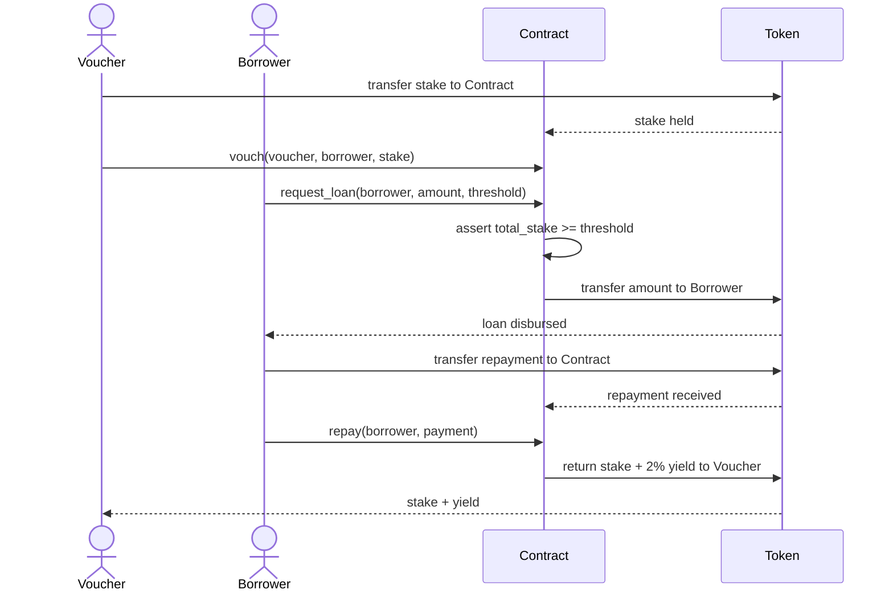
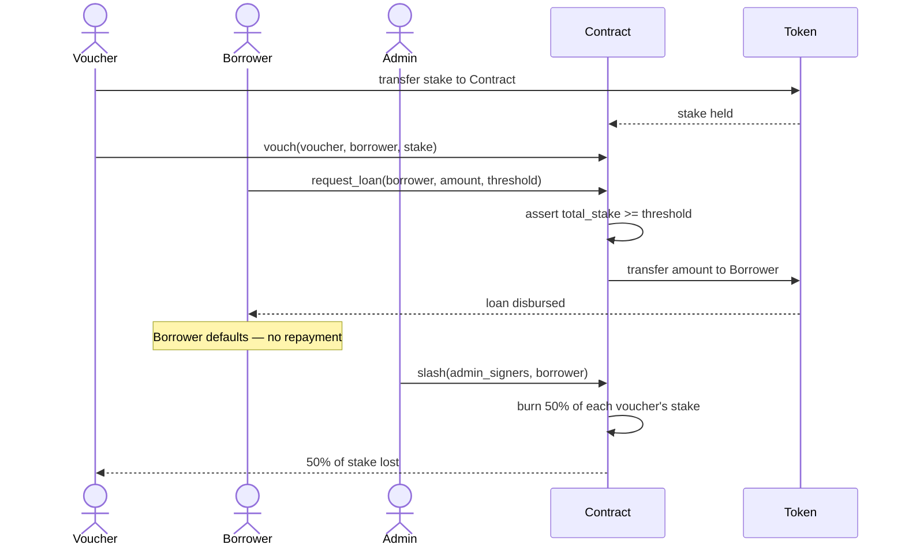
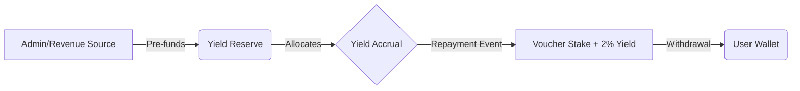

# QuorumCredit — Proof of Trust (PoT) Microlending
................
> Trustless microlending powered by your social trust graph — built on Stellar Soroban.

Platform: Stellar Soroban | Language: Rust | License: MIT

[](https://github.com/your-org/QuorumCredit/actions/workflows/ci.yml)
[](https://codecov.io/gh/your-org/QuorumCredit)

---

## About

QuorumCredit is a decentralized microlending platform that replaces asset collateral with **social collateral**. Inspired by Stellar's **Federated Byzantine Agreement (FBA)**, it lets communities vouch for borrowers using staked XLM — no over-collateralization required.

Traditional DeFi lending demands $100 locked up to borrow $50. QuorumCredit flips this: your trust network is your collateral. Vouchers stake XLM to back a borrower. If the loan is repaid, vouchers earn yield. If the borrower defaults, vouchers are slashed.

This platform is designed for developers building on Stellar, fintech teams targeting underserved communities, and anyone exploring social-trust-based credit systems.

---

## Table of Contents

- [Quick Start](#quick-start)
- [Stroop Unit Convention](#stroop-unit-convention)
- [How It Works](#how-it-works)
- [Project Structure](#project-structure)
- [Setup Instructions](#setup-instructions)
- [Testing](#testing)
- [Deployment](#deployment)
- [Security Best Practices](SECURITY_BEST_PRACTICES.md)
- [Documentation](#documentation)
- [Architecture](#architecture)
- [Error Reference](#error-reference)
- [Contributing](#contributing)

---

## Stroop Unit Convention

> [!IMPORTANT]
> **All monetary amounts throughout this contract are denominated in _stroops_.**

Stellar's smallest indivisible unit is the **stroop**:

| Unit     | Conversion                     |
|----------|--------------------------------|
| 1 XLM    | 10,000,000 stroops             |
| 1 stroop | 0.0000001 XLM (10⁻⁷ XLM)      |

This applies universally to every `i128` parameter or field in the contract that represents a token quantity, including:

| Field / Parameter     | Where used                                      |
|-----------------------|-------------------------------------------------|
| `stake`               | `vouch()`, `batch_vouch()`, `increase_stake()`, `decrease_stake()` |
| `amount`              | `request_loan()`, `set_min_stake()`, `set_max_loan_amount()` |
| `payment`             | `repay()`                                       |
| `threshold`           | `request_loan()`, `is_eligible()`               |
| `LoanRecord.amount`   | Total principal disbursed                       |
| `LoanRecord.amount_repaid` | Cumulative repayment received             |
| `LoanRecord.total_yield`   | Yield locked in at disbursement           |
| `VouchRecord.stake`   | Staked collateral per voucher                   |
| `Config.min_loan_amount` | Protocol minimum loan size                  |
| `DEFAULT_MIN_LOAN_AMOUNT` | 100,000 stroops = 0.01 XLM              |
| `DEFAULT_MIN_YIELD_STAKE` | 50 stroops (minimum for non-zero yield) |

### Conversion helpers

```
// Rust (off-chain tooling)
fn xlm_to_stroops(xlm: f64) -> i128 { (xlm * 10_000_000.0) as i128 }
fn stroops_to_xlm(stroops: i128) -> f64 { stroops as f64 / 10_000_000.0 }
```

```js
// JavaScript / TypeScript (frontend / SDK)
const XLM_TO_STROOPS = 10_000_000n;
const xlmToStroops = (xlm) => BigInt(Math.round(xlm * 10_000_000));
const stroopsToXlm  = (stroops) => Number(stroops) / 10_000_000;
```

> [!NOTE]
> When reading `LoanRecord`, `VouchRecord`, or any balance returned by the contract,
> divide by `10_000_000` to display the equivalent XLM to users.
> When accepting user input in XLM, multiply by `10_000_000` before passing to contract functions.

---

## Quick Start

```bash
# Clone the repository
git clone https://github.com/your-org/QuorumCredit.git
cd QuorumCredit

# Build the contract
cd QuorumCredit
cargo build --target wasm32-unknown-unknown --release

# Run tests
cargo test
```

---

## How It Works

### 1. Vouching
Users stake XLM to vouch for a borrower in their network. This stake is transferred into the contract and held as social collateral.

### 2. Loan Eligibility
A borrower becomes eligible once their total vouched stake meets the minimum threshold — no personal collateral needed.

### 3. Repayment & Default

| Outcome | Borrower | Vouchers |
|---|---|---|
| Loan repaid ✅ | Debt cleared, credit history improves | Earn 2% yield on staked XLM |
| Default ❌ | Flagged, future borrowing restricted | 50% of stake slashed |

> **Minimum stake for yield:** A vouch must be at least **50 stroops** to earn non-zero yield.
> At the default 2% rate (200 bps), `stake * 200 / 10_000` truncates to zero for any stake
> under 50 stroops. The contract enforces this minimum in `vouch()` and rejects smaller stakes
> with a clear error rather than silently paying no yield.

### The FBA Inspiration

Stellar nodes select their own **Quorum Slice** — a trusted subset of peers. QuorumCredit mirrors this: each borrower's eligibility is determined by their personal trust graph, not a central credit bureau. You aren't trusting a bank; you're trusting a specific slice of your social network.

---

## Project Structure

```
QuorumCredit/
├── QuorumCredit/
│   ├── Cargo.toml          # Contract crate (Soroban SDK)
│   └── src/
│       └── lib.rs          # Contract: initialize, vouch, request_loan, repay, slash
├── Cargo.toml              # Workspace root
└── README.md               # This file
```

**Key contract entry points:**

| Function | Description |
|---|---|
| `initialize(deployer, admin, token)` | One-time setup — deployer must sign; sets admin and XLM token address |
| `vouch(voucher, borrower, stake)` | Stake XLM to back a borrower |
| `request_loan(borrower, amount, threshold)` | Disburse loan if stake threshold is met |
| `repay(borrower)` | Repay loan; vouchers receive 2% yield |
| `slash(borrower)` | Admin marks default; 50% of voucher stakes burned |
| `get_loan(borrower)` | Read a borrower's active loan record |
| `get_vouches(borrower)` | Read all vouches for a borrower |

---

## 🛡️ Access Control Matrix

| Function | Role Required | Description | Impact |
|---|---|---|---|
| `initialize` | **Deployer** | One-time setup of Admin and Token addresses. | Sets security foundation. |
| `vouch` | **Voucher** | Stake XLM to back a borrower. | Increases borrower trust score. |
| `request_loan` | **Borrower** | Withdraw loan funds to borrower wallet. | Disburses capital. |
| `repay` | **Borrower** | Clear debt and distribute yield to vouchers. | Restores trust and rewards vouchers. |
| `slash` | **Admin** | Signal default and burn 50% of voucher stakes. | Penalizes default; enforces risk. |
| `get_loan` | **Anyone** | Read active loan records. | Transparency. |
| `get_vouches` | **Anyone** | Read voucher lists for a borrower. | Transparency. |

---

## Setup Instructions

### Requirements

- Rust (latest stable)
- Stellar CLI (`stellar-cli`)
- A Stellar account (for deployment)

### 1. Install Rust

```bash
curl --proto '=https' --tlsv1.2 -sSf https://sh.rustup.rs | sh
rustup target add wasm32-unknown-unknown
```

### 2. Install Stellar CLI

```bash
cargo install --locked stellar-cli
stellar --version
```

### 3. Configure Networks

```bash
# Testnet (recommended for development)
stellar network add testnet \
  --rpc-url https://soroban-testnet.stellar.org:443 \
  --network-passphrase "Test SDF Network ; September 2015"

# Mainnet
stellar network add mainnet \
  --rpc-url https://rpc.mainnet.stellar.org:443 \
  --network-passphrase "Public Global Stellar Network ; September 2015"
```

### 4. Environment Variables

Create a `.env` file (never commit this):

```bash
NETWORK=testnet
DEPLOYER_SECRET_KEY="SB..."   # Your deployer secret key
ADMIN_ADDRESS="GB..."         # Admin account address
TOKEN_CONTRACT="..."          # XLM token contract address
```

> ⚠️ Add `.env` to your `.gitignore`. Never commit secret keys.

---

## Testing

```bash
# Run all tests
cd QuorumCredit
cargo test

# Run with output
cargo test -- --nocapture

# Run a specific test
cargo test test_repay_gives_voucher_yield
```

**Test coverage:**

| Test | Verifies |
|---|---|
| `test_vouch_and_loan_disbursed` | Loan record created, funds transferred to borrower |
| `test_repay_gives_voucher_yield` | Voucher receives original stake + 2% yield |
| `test_slash_burns_half_stake` | Voucher loses 50% of stake on default |
| `test_unauthorized_initialize_rejected` | `initialize` panics when called without deployer's signature |

---

## Deployment

### Security: Deployer-Gated Initialization

`initialize` requires the `deployer` address to sign the transaction (`deployer.require_auth()`). This closes the front-running window that exists between contract deployment and initialization:

1. An attacker observing the deployment transaction on-chain cannot call `initialize` first — they cannot forge the deployer's signature.
2. The deployer address is stored in contract storage (`DataKey::Deployer`) for auditability.

**Required deployment sequence — do not deviate:**

```
Step 1: Build the WASM
Step 2: Deploy the contract  ← deployer keypair signs this tx
Step 3: Initialize the contract ← SAME deployer keypair must sign this tx
```

If steps 2 and 3 are not signed by the same keypair, `initialize` will panic and the contract remains uninitialized.

## Documentation

Project reference documentation is generated automatically from the Rust workspace and published to GitHub Pages on every merge to `main`.

Visit the published docs at:

https://ndifreke000.github.io/QuorumCredit/

### Deploy to Testnet

```bash
# Build
cargo build --target wasm32-unknown-unknown --release

# Step 1 — Deploy (note the returned CONTRACT_ID)
stellar contract deploy \
  --wasm target/wasm32-unknown-unknown/release/quorum_credit.wasm \
  --network testnet \
  --source $DEPLOYER_SECRET_KEY

# Step 2 — Initialize immediately after deploy, using the SAME source key
# deployer = the account that signed the deploy tx above
stellar contract invoke \
  --id $CONTRACT_ID \
  --fn initialize \
  --network testnet \
  --source $DEPLOYER_SECRET_KEY \
  -- \
  --deployer $DEPLOYER_ADDRESS \
  --admin $ADMIN_ADDRESS \
  --token $TOKEN_CONTRACT
```

> The `--source` key for `invoke` must match `--deployer`. Using any other key will cause `require_auth()` to reject the call.

### Deploy to Mainnet

> ⚠️ Production checklist before deploying:
> - [ ] All tests passing
> - [ ] Security audit completed
> - [ ] Testnet deployment verified
> - [ ] Admin keys secured (multisig recommended)
> - [ ] Token contract address confirmed

```bash
stellar contract deploy \
  --wasm target/wasm32-unknown-unknown/release/quorum_credit.wasm \
  --network mainnet \
  --source $DEPLOYER_SECRET_KEY
```

### Upgrading the Contract

The `upgrade` function allows the admin (or multisig quorum) to replace the contract WASM after deployment. This is the only path to patching a live vulnerability.

**Upgrade process:**

```
Step 1: Build the new WASM
Step 2: (Recommended) Pause the contract to halt user activity
Step 3: Upload the new WASM and obtain its hash
Step 4: Call upgrade() — requires admin_threshold signatures
Step 5: Unpause the contract
```

```bash
# Step 1 — Build
cargo build --target wasm32-unknown-unknown --release

# Step 2 — Pause (recommended)
stellar contract invoke \
  --id $CONTRACT_ID --fn pause --network testnet --source $ADMIN_SECRET_KEY \
  -- --admin_signers '["'$ADMIN_ADDRESS'"]'

# Step 3 — Upload new WASM, capture the returned hash
NEW_WASM_HASH=$(stellar contract install \
  --wasm target/wasm32-unknown-unknown/release/quorum_credit.wasm \
  --network testnet \
  --source $ADMIN_SECRET_KEY)

# Step 4 — Upgrade (admin_threshold admins must sign)
stellar contract invoke \
  --id $CONTRACT_ID --fn upgrade --network testnet --source $ADMIN_SECRET_KEY \
  -- \
  --admin_signers '["'$ADMIN_ADDRESS'"]' \
  --new_wasm_hash $NEW_WASM_HASH

# Step 5 — Unpause
stellar contract invoke \
  --id $CONTRACT_ID --fn unpause --network testnet --source $ADMIN_SECRET_KEY \
  -- --admin_signers '["'$ADMIN_ADDRESS'"]'
```

> ⚠️ The `upgrade` call requires `admin_threshold` distinct admin signatures — the same multisig quorum used for all other admin operations. A single compromised key cannot unilaterally upgrade the contract.

---

## Architecture

```
Borrower
   └── requests loan
         └── Trust Circle (Quorum Slice)
               ├── Voucher A — stakes XLM
               ├── Voucher B — stakes XLM
               └── Voucher C — stakes XLM
                     └── Threshold met → Loan disbursed
                           ├── Repaid → Vouchers earn 2% yield
                           └── Default → 50% of stakes slashed
```

### Loan Lifecycle: Repay Flow



### Loan Lifecycle: Slash Flow



**Key concepts:**

- **Proof of Trust (PoT):** Social collateral replaces asset collateral
- **Quorum Slice:** Your personal set of trusted vouchers, mirroring FBA logic
- **Slash Mechanism:** Vouchers lose 50% of stake on borrower default — aligning incentives
- **Yield on Trust:** Vouchers earn 2% yield for backing reliable borrowers

**Why Stellar?**

- Near-zero transaction fees — critical for microlending viability
- Fast finality (~5s) — practical for real-world loan cycles
- Soroban smart contracts — expressive enough for trust graph logic
- Native XLM — no bridging complexity for staking and disbursement

---

## 💰 Yield Accounting & Solvency

QuorumCredit uses a **Sustainable Pre-funding Model** for yield distribution. Unlike many DeFi protocols, yield is not "minted" into existence, ensuring no inflationary pressure on the underlying XLM asset.

### Funding Source
Yield is sourced from a dedicated **Yield Reserve** within the contract. For vouchers to earn their 2% yield (`YIELD_BPS = 200`), the contract must be pre-funded by the protocol admin or through external revenue streams (e.g., protocol fees). 

> [!IMPORTANT]
> The contract must hold sufficient XLM to cover both the principal repayment and the 2% yield. If the reserve is empty, the protocol cannot disburse rewards.

### Solvency & "Hard-Cap" Logic
To ensure the protocol never owes more than it holds, a **Hard-Cap Solvency** model is enforced:
1. **Reserve Check**: The protocol only allows loan disbursement if the contract has sufficient liquidity to cover the loan amount.
2. **Yield Protection**: If the Yield Reserve is depleted, the $2.0\%$ yield accrual effectively halts. In the current implementation, any attempt to pay out yield without sufficient funds will trigger a Soroban `InsufficientFunds` panic, protecting the protocol's integrity.

### Yield Flow Diagram



## Error Reference

All contract errors are defined in `src/errors.rs` as the `ContractError` enum. Each variant is returned as a typed Soroban error — integrators can match on these values rather than parsing strings.

| Code | Variant | Trigger | Resolution |
|------|---------|---------|------------|
| 1 | `InsufficientFunds` | Stake or amount ≤ 0 passed to `vouch`/`request_loan`; or total vouched stake is below the requested loan threshold; or contract balance is below the loan amount. | Ensure the amount is positive. For loans, verify total stake meets the threshold and the contract holds sufficient liquidity. |
| 2 | `ActiveLoanExists` | `vouch()` called for a borrower who already has an active loan. | Wait until the existing loan is repaid or slashed before adding new vouches. |
| 3 | `StakeOverflow` | Summing all vouched stakes for a borrower would overflow `i128`. | Reduce the number or size of vouches for this borrower. |
| 4 | `ZeroAddress` | An admin or token address passed to `initialize`/`set_config` is the all-zeros Stellar address. | Provide a valid, non-zero address. |
| 5 | `DuplicateVouch` | The same voucher attempts to vouch for the same borrower with the same token more than once. | Use `increase_stake` to add more stake to an existing vouch instead. |
| 6 | `NoActiveLoan` | `repay`, `slash`, or `withdraw_vouch` called when no active loan exists for the borrower. | Confirm the borrower address and that a loan has been disbursed and not yet closed. |
| 7 | `ContractPaused` | Any state-mutating function called while the contract is paused. | Wait for an admin to call `unpause`. |
| 8 | `LoanPastDeadline` | Repayment attempted after the loan deadline has passed. | The loan must be resolved via `slash`. |
| 13 | `MinStakeNotMet` | Vouch stake is below the admin-configured `min_stake`. | Increase the stake to at least `get_min_stake()` stroops. |
| 14 | `LoanExceedsMaxAmount` | Requested loan amount exceeds the admin-configured `max_loan_amount`. | Request a smaller amount or ask an admin to raise the cap via `set_max_loan_amount`. |
| 15 | `InsufficientVouchers` | Number of vouchers for the requested token is below the admin-configured `min_vouchers`. | Recruit more vouchers before requesting the loan. |
| 16 | `UnauthorizedCaller` | `repay` called by an address that is not the borrower on record; or `withdraw_vouch` called by an address with no vouch for that borrower. | Ensure the transaction is signed by the correct borrower or voucher. |
| 17 | `InvalidAmount` | A numeric parameter fails a basic validity check (e.g. negative fee BPS). | Pass a value within the documented valid range. |
| 18 | `InvalidStateTransition` | An operation was attempted that is not valid for the loan's current status. | Check `loan_status()` before calling state-changing functions. |
| 19 | `AlreadyInitialized` | `initialize` called on a contract that has already been initialized. | `initialize` is one-time only; no action needed. |
| 20 | `VouchTooRecent` | A vouch was added too recently (within `MIN_VOUCH_AGE` seconds) before `request_loan` is called. | Wait for the vouch age requirement to pass before requesting the loan. |
| 24 | `Blacklisted` | `request_loan` called by an address that an admin has blacklisted. | Contact the protocol admin. |
| 25 | `TimelockNotFound` | A governance timelock operation references an ID that does not exist. | Verify the timelock ID returned when the operation was queued. |
| 26 | `TimelockNotReady` | A timelocked operation is executed before its delay has elapsed. | Wait until the timelock delay has passed, then retry. |
| 27 | `TimelockExpired` | A timelocked operation is executed after its expiry window. | Re-queue the operation and execute it within the allowed window. |
| 28 | `NoVouchesForBorrower` | A governance slash vote is initiated for a borrower with no vouches on record. | Verify the borrower address. |
| 29 | `VoucherNotFound` | A governance slash vote references a voucher address not in the borrower's vouch list. | Verify the voucher address. |
| 30 | `InvalidToken` | A token address passed to `vouch` or `request_loan` is not the primary protocol token and is not in the admin-approved `allowed_tokens` list; or the address does not implement the SEP-41 token interface. | Use `get_config()` to retrieve the list of allowed tokens. |
| 31 | `AlreadyVoted` | A voucher attempts to cast a second slash vote for the same borrower. | Each voucher may vote once per slash proposal. |
| 32 | `SlashVoteNotFound` | `execute_slash_vote` called for a borrower with no open slash proposal. | Initiate a slash vote first via `initiate_slash_vote`. |
| 33 | `SlashAlreadyExecuted` | A slash vote is executed more than once for the same borrower. | No action needed; the slash has already been applied. |
| 34 | `AlreadyRepaid` | `repay` called on a loan that has already been fully repaid. | No action needed; the loan is closed. |

> Errors with codes 9–12 (`PoolLengthMismatch`, `PoolEmpty`, `PoolBorrowerActiveLoan`, `PoolInsufficientFunds`) and 21–23 (`VouchCooldownActive`, `BorrowerHasActiveLoan`, `VoucherNotWhitelisted`) are reserved for pool and whitelist features currently under development.

---

## API Reference

This section provides comprehensive documentation for all public functions, storage keys, events, and data structures in the QuorumCredit smart contract.

### Public Functions

#### Initialization & Admin

##### `initialize(deployer, admins, admin_threshold, token)`
**Signature**: `fn initialize(env: Env, deployer: Address, admins: Vec<Address>, admin_threshold: u32, token: Address) -> Result<(), ContractError>`

One-time contract initialization. Sets up the protocol with admin addresses, threshold for multi-sig operations, and the primary token.

**Parameters**:
- `deployer`: Address that deployed the contract (must sign the transaction)
- `admins`: Vector of admin addresses for governance
- `admin_threshold`: Minimum number of admins required for approval (1-`admins.len()`)
- `token`: Primary token contract address (must implement SEP-41)

**Errors**: `AlreadyInitialized`, `InvalidAdminThreshold`, `InvalidToken`, `ZeroAddress`

**Events**: `contract/init` with `(deployer, admins, admin_threshold, token)`

##### `set_config(admin_signers, config)`
**Signature**: `fn set_config(env: Env, admin_signers: Vec<Address>, config: Config)`

Update the entire protocol configuration. Requires admin approval.

**Parameters**:
- `admin_signers`: Vector of admin addresses (must meet threshold)
- `config`: New configuration struct

**Errors**: Admin approval errors

##### `update_config(admin_signers, yield_bps, slash_bps)`
**Signature**: `fn update_config(env: Env, admin_signers: Vec<Address>, yield_bps: Option<i128>, slash_bps: Option<i128>)`

Update specific configuration parameters. Requires admin approval.

**Parameters**:
- `admin_signers`: Vector of admin addresses (must meet threshold)
- `yield_bps`: Optional new yield rate in basis points
- `slash_bps`: Optional new slash rate in basis points

**Errors**: Admin approval errors

##### `pause(admin_signers)`
**Signature**: `fn pause(env: Env, admin_signers: Vec<Address>)`

Pause the contract, preventing all state-changing operations except admin functions.

**Parameters**:
- `admin_signers`: Vector of admin addresses (must meet threshold)

**Errors**: Admin approval errors

##### `unpause(admin_signers)`
**Signature**: `fn unpause(env: Env, admin_signers: Vec<Address>)`

Resume contract operations after pausing.

**Parameters**:
- `admin_signers`: Vector of admin addresses (must meet threshold)

**Errors**: Admin approval errors

#### Vouching

##### `vouch(voucher, borrower, stake, token)`
**Signature**: `fn vouch(env: Env, voucher: Address, borrower: Address, stake: i128, token: Address) -> Result<(), ContractError>`

Stake tokens to vouch for a borrower. Creates social collateral.

**Parameters**:
- `voucher`: Address staking tokens
- `borrower`: Address being vouched for
- `stake`: Amount to stake in stroops (must be > 0)
- `token`: Token contract address (must be allowed)

**Errors**: `SelfVouchNotAllowed`, `ActiveLoanExists`, `DuplicateVouch`, `MinStakeNotMet`, `InvalidToken`, `InsufficientVoucherBalance`, `ContractPaused`

**Events**: `vouch/create` with `(voucher, borrower, stake, token)`

##### `batch_vouch(voucher, borrowers, stakes, token)`
**Signature**: `fn batch_vouch(env: Env, voucher: Address, borrowers: Vec<Address>, stakes: Vec<i128>, token: Address) -> Result<(), ContractError>`

Stake for multiple borrowers in a single atomic transaction. Implements all-or-nothing semantics: all vouches are fully validated before any state is mutated or tokens are transferred. If any single vouch fails validation, the entire batch is rejected and no state changes occur — the borrower list is never left in a partially-vouched state.

**Atomic guarantee**: Phase 1 runs `validate_vouch` for every entry in the batch. Only if all entries pass does Phase 2 call `commit_vouch` for each entry. A failure in Phase 1 returns immediately without touching storage or token balances.

**Parameters**:
- `voucher`: Address staking tokens (must sign the transaction)
- `borrowers`: Vector of borrower addresses
- `stakes`: Vector of stake amounts in stroops (must be same length as `borrowers`)
- `token`: Token contract address (must be allowed)

**Errors**: Same as `vouch()`. Returns `InsufficientFunds` if `borrowers` and `stakes` lengths differ or the batch is empty.

##### `increase_stake(voucher, borrower, additional_stake, token)`
**Signature**: `fn increase_stake(env: Env, voucher: Address, borrower: Address, additional_stake: i128, token: Address) -> Result<(), ContractError>`

Add more stake to an existing vouch.

**Parameters**:
- `voucher`: Address increasing stake
- `borrower`: Address being vouched for
- `additional_stake`: Additional amount to stake in stroops
- `token`: Token contract address

**Errors**: `NoVouchesForBorrower`, `VoucherNotFound`, `InvalidToken`, `ContractPaused`

##### `decrease_stake(voucher, borrower, reduced_stake, token)`
**Signature**: `fn decrease_stake(env: Env, voucher: Address, borrower: Address, reduced_stake: i128, token: Address) -> Result<(), ContractError>`

Reduce stake in an existing vouch (cannot reduce below minimum).

**Parameters**:
- `voucher`: Address reducing stake
- `borrower`: Address being vouched for
- `reduced_stake`: New total stake amount in stroops
- `token`: Token contract address

**Errors**: `NoVouchesForBorrower`, `VoucherNotFound`, `MinStakeNotMet`, `InvalidToken`, `ContractPaused`

##### `withdraw_vouch(voucher, borrower, token)`
**Signature**: `fn withdraw_vouch(env: Env, voucher: Address, borrower: Address, token: Address) -> Result<(), ContractError>`

Completely withdraw a vouch and return staked tokens.

**Parameters**:
- `voucher`: Address withdrawing vouch
- `borrower`: Address being vouched for
- `token`: Token contract address

**Errors**: `NoVouchesForBorrower`, `VoucherNotFound`, `ActiveLoanExists`, `InvalidToken`, `ContractPaused`

#### Loans

##### `request_loan(borrower, amount, threshold, loan_purpose, token)`
**Signature**: `fn request_loan(env: Env, borrower: Address, amount: i128, threshold: i128, loan_purpose: String, token: Address) -> Result<(), ContractError>`

Request a loan if sufficient vouches exist. Disburses funds to borrower.

**Parameters**:
- `borrower`: Address requesting loan
- `amount`: Loan amount in stroops
- `threshold`: Minimum total stake required
- `loan_purpose`: Description of loan purpose
- `token`: Token contract address

**Errors**: `Blacklisted`, `LoanBelowMinAmount`, `LoanExceedsMaxAmount`, `InsufficientFunds`, `InsufficientVouchers`, `VouchTooRecent`, `InvalidToken`, `ContractPaused`

**Events**: `loan/request` with `(borrower, amount, threshold, loan_purpose, token)`

##### `repay(borrower, payment)`
**Signature**: `fn repay(env: Env, borrower: Address, payment: i128) -> Result<(), ContractError>`

Repay loan principal and yield. Distributes yield to vouchers.

**Parameters**:
- `borrower`: Address repaying loan
- `payment`: Payment amount in stroops

**Errors**: `NoActiveLoan`, `LoanPastDeadline`, `InvalidAmount`, `UnauthorizedCaller`, `ContractPaused`

**Events**: `loan/repay` with `(borrower, payment)`

#### Governance

##### `vote_slash(voucher, borrower, approve)`
**Signature**: `fn vote_slash(env: Env, voucher: Address, borrower: Address, approve: bool) -> Result<(), ContractError>`

Vote on whether to slash a defaulted borrower.

**Parameters**:
- `voucher`: Address voting
- `borrower`: Address of defaulted borrower
- `approve`: True to approve slash, false to reject

**Errors**: `NoVouchesForBorrower`, `VoucherNotFound`, `AlreadyVoted`, `ContractPaused`

##### `execute_slash_vote(borrower)`
**Signature**: `fn execute_slash_vote(env: Env, borrower: Address) -> Result<(), ContractError>`

Execute slash if quorum is met.

**Parameters**:
- `borrower`: Address to slash

**Errors**: `SlashVoteNotFound`, `SlashAlreadyExecuted`, `QuorumNotMet`

#### Queries

##### `get_admins() -> Vec<Address>`
**Signature**: `fn get_admins(env: Env) -> Vec<Address>`

Get the list of admin addresses.

**Returns**: Vector of admin addresses

##### `get_config() -> Config`
**Signature**: `fn get_config(env: Env) -> Config`

Get the current protocol configuration.

**Returns**: Config struct

##### `get_fee_treasury() -> i128`
**Signature**: `fn get_fee_treasury(env: Env) -> i128`

Get the accumulated protocol fees balance.

**Returns**: Balance in stroops

##### `loan_status(borrower) -> LoanStatus`
**Signature**: `fn loan_status(env: Env, borrower: Address) -> LoanStatus`

Get the loan status for a borrower.

**Parameters**:
- `borrower`: Borrower address

**Returns**: LoanStatus enum

##### `get_loan(borrower) -> Option<LoanRecord>`
**Signature**: `fn get_loan(env: Env, borrower: Address) -> Option<LoanRecord>`

Get the active loan record for a borrower.

**Parameters**:
- `borrower`: Borrower address

**Returns**: Option containing LoanRecord

##### `get_vouches(borrower) -> Option<Vec<VouchRecord>>`
**Signature**: `fn get_vouches(env: Env, borrower: Address) -> Option<Vec<VouchRecord>>`

Get all vouches for a borrower.

**Parameters**:
- `borrower`: Borrower address

**Returns**: Option containing vector of VouchRecord

##### `is_eligible(borrower, threshold, token_addr) -> bool`
**Signature**: `fn is_eligible(env: Env, borrower: Address, threshold: i128, token_addr: Address) -> bool`

Check if a borrower is eligible for a loan.

**Parameters**:
- `borrower`: Borrower address
- `threshold`: Minimum stake required
- `token_addr`: Token address

**Returns**: True if eligible

##### `total_vouched(borrower) -> Result<i128, ContractError>`
**Signature**: `fn total_vouched(env: Env, borrower: Address) -> Result<i128, ContractError>`

Get total vouched amount for a borrower.

**Parameters**:
- `borrower`: Borrower address

**Returns**: Total vouched amount in stroops

### Storage Keys

All storage uses Soroban persistent storage with the following keys:

| Key | Type | Purpose |
|-----|------|---------|
| `DataKey::Config` | `Config` | Protocol configuration parameters |
| `DataKey::Deployer` | `Address` | Contract deployer address |
| `DataKey::Loan(loan_id)` | `LoanRecord` | Individual loan records |
| `DataKey::ActiveLoan(borrower)` | `u64` | Active loan ID for borrower |
| `DataKey::LatestLoan(borrower)` | `u64` | Latest loan ID for borrower |
| `DataKey::Vouches(borrower)` | `Vec<VouchRecord>` | All vouches for a borrower |
| `DataKey::Paused` | `bool` | Contract pause state |
| `DataKey::SlashTreasury` | `i128` | Accumulated slashed funds |
| `DataKey::ProtocolFeeBps` | `u32` | Protocol fee in basis points |
| `DataKey::FeeTreasury` | `Address` | Fee treasury address |
| `DataKey::SlashVote(borrower)` | `SlashVoteRecord` | Active slash vote |
| `DataKey::RepaymentCount(borrower)` | `u32` | Successful repayment count |
| `DataKey::LoanCount(borrower)` | `u32` | Total loan count |
| `DataKey::DefaultCount(borrower)` | `u32` | Default count |

### Events

The contract emits the following events:

| Event | Data | Trigger |
|-------|------|---------|
| `contract/init` | `(deployer, admins, admin_threshold, token)` | Contract initialization |
| `vouch/create` | `(voucher, borrower, stake, token)` | New vouch created |
| `vouch/increase` | `(voucher, borrower, additional_stake, token)` | Stake increased |
| `vouch/decrease` | `(voucher, borrower, reduced_stake, token)` | Stake decreased |
| `vouch/withdraw` | `(voucher, borrower, returned_stake, token)` | Vouch withdrawn |
| `loan/request` | `(borrower, amount, threshold, loan_purpose, token)` | Loan requested |
| `loan/repay` | `(borrower, payment)` | Loan repayment |
| `loan/slash` | `(borrower, slashed_amount)` | Loan slashed |
| `admin/config` | `(admin, config)` | Configuration updated |
| `admin/pause` | `(admin)` | Contract paused |
| `admin/unpause` | `(admin)` | Contract unpaused |

### Data Structures

#### Config
```rust
pub struct Config {
    pub admins: Vec<Address>,
    pub admin_threshold: u32,
    pub token: Address,
    pub allowed_tokens: Vec<Address>,
    pub yield_bps: i128,
    pub slash_bps: i128,
    pub max_vouchers: u32,
    pub min_loan_amount: i128,
    pub loan_duration: u64,
    pub max_loan_to_stake_ratio: u32,
    pub grace_period: u64,
}
```

#### LoanRecord
```rust
pub struct LoanRecord {
    pub id: u64,
    pub borrower: Address,
    pub co_borrowers: Vec<Address>,
    pub amount: i128,
    pub amount_repaid: i128,
    pub total_yield: i128,
    pub status: LoanStatus,
    pub created_at: u64,
    pub disbursement_timestamp: u64,
    pub repayment_timestamp: Option<u64>,
    pub deadline: u64,
    pub loan_purpose: String,
    pub token_address: Address,
}
```

#### VouchRecord
```rust
pub struct VouchRecord {
    pub voucher: Address,
    pub stake: i128,
    pub vouch_timestamp: u64,
    pub token: Address,
}
```

#### LoanStatus
```rust
pub enum LoanStatus {
    None,
    Active,
    Repaid,
    Defaulted,
}
```

### Examples

#### Basic Loan Flow
```javascript
// 1. Initialize contract
await contract.initialize(deployer, [admin], 1, tokenAddress);

// 2. Voucher stakes for borrower
await contract.vouch(voucher, borrower, 10000000000n, tokenAddress); // 1000 XLM

// 3. Borrower requests loan
await contract.requestLoan(borrower, 5000000000n, 10000000000n, "Business expansion", tokenAddress);

// 4. Borrower repays loan
await contract.repay(borrower, 5100000000n); // Principal + 2% yield
```

#### Admin Configuration
```javascript
// Update yield rate to 3%
await contract.updateConfig([admin], 300n, null);

// Set protocol fee to 0.5%
await contract.setProtocolFee([admin], 50);
```

### Troubleshooting

#### Common Issues
- **InsufficientFunds**: Ensure contract has enough tokens and borrower has sufficient vouches
- **LoanPastDeadline**: Loans must be repaid before deadline; use slash for defaults
- **ContractPaused**: Wait for admin to unpause or contact protocol administrators
- **InvalidToken**: Only use allowed tokens; check `getConfig().allowedTokens`

#### Debug Steps
1. Check contract balance: `getContractBalance()`
2. Verify vouches: `getVouches(borrower)`
3. Check loan status: `loanStatus(borrower)`
4. Review configuration: `getConfig()`

---

## Frequently Asked Questions (FAQ)

### Protocol

**What is QuorumCredit?**
QuorumCredit is a decentralized microlending protocol on Stellar Soroban that replaces asset collateral with social collateral. Vouchers stake XLM to back borrowers they trust. If the loan is repaid, vouchers earn yield. If the borrower defaults, vouchers are slashed.

**What happens if a borrower defaults?**
After the loan deadline passes without full repayment, an admin (or quorum of vouchers via `vote_slash`) can trigger a slash. Each voucher loses `slash_bps / 10_000` of their staked amount (default: 50%). The slashed funds accumulate in the slash treasury. The borrower's default count increments, affecting future loan eligibility.

**Can I vouch for multiple borrowers at once?**
Yes — use `batch_vouch(voucher, borrowers, stakes, token)`. It provides atomic all-or-nothing semantics: all vouches are validated before any state changes. If one entry is invalid, the entire batch is rejected and no tokens are transferred.

**What is the minimum stake to earn yield?**
50 stroops (0.000005 XLM). At the default 2% yield rate, `stake * 200 / 10_000` truncates to zero for stakes below 50 stroops. The contract enforces this minimum and rejects smaller stakes with `MinStakeNotMet`.

**Can I withdraw my vouch?**
Yes, with restrictions. You can call `withdraw_vouch()` or `decrease_stake()` at any time — unless the borrower has an active loan. Once a loan is disbursed, your stake is locked until the loan is repaid or defaulted. This protects borrowers from having their collateral pulled mid-loan.

**How is yield funded?**
Yield is sourced from a pre-funded yield reserve held by the contract. It is not minted — the contract must hold sufficient tokens to cover both principal and yield at repayment time. If the reserve is depleted, repayment will fail with `InsufficientFunds`. Admins are responsible for maintaining the reserve.

**What tokens are supported?**
The primary token is set at initialization. Admins can add additional SEP-41-compliant tokens via `add_allowed_token()`. All amounts are denominated in the token's smallest unit (stroops for XLM: 1 XLM = 10,000,000 stroops).

**Is there a cooldown between vouches?**
Yes. By default, a voucher must wait 24 hours between vouch calls (`DEFAULT_VOUCH_COOLDOWN_SECS`). This is configurable by admins. Attempting to vouch before the cooldown expires returns `VouchCooldownActive`.

### Deployment

**How do I deploy to testnet?**
See the [Deployment](#deployment) section. The key requirement is that the same keypair that signs the `deploy` transaction must also sign the `initialize` transaction. Using a different key will cause `initialize` to panic.

**Can I upgrade the contract after deployment?**
Yes, via `upgrade(admin_signers, new_wasm_hash)`. This requires `admin_threshold` admin signatures. It is recommended to pause the contract before upgrading and unpause after. See the [Deployment](#deployment) section for the full upgrade sequence.

**What network passphrase should I use?**
- Testnet: `"Test SDF Network ; September 2015"`
- Mainnet: `"Public Global Stellar Network ; September 2015"`

**How do I set up multisig admin?**
Pass multiple addresses in the `admins` vector during `initialize` and set `admin_threshold` to the required quorum (e.g., 2-of-3). All admin functions require `admin_threshold` distinct admin signatures.

### Operation

**How do I pause the contract in an emergency?**
Call `pause(admin_signers)` with sufficient admin signatures. All state-mutating functions will return `ContractPaused` until `unpause(admin_signers)` is called.

**How do I check if a borrower is eligible for a loan?**
Call `is_eligible(borrower, threshold, token_addr)`. This returns `true` if the total stake from vouches for that borrower meets or exceeds `threshold` for the given token.

**How do I monitor slash votes?**
Vouchers call `vote_slash(voucher, borrower, approve)`. Once the approve stake reaches `slash_vote_quorum` (default 50% of total stake), the slash executes automatically. Query the slash vote state via `get_slash_vote_quorum()`.

**Where do slashed funds go?**
Into the slash treasury (`DataKey::SlashTreasury`). Admins can withdraw via `withdraw_slash_treasury(admin_signers, recipient, amount)`.

**How do I read contract events off-chain?**
See [INTEGRATION_GUIDE.md](INTEGRATION_GUIDE.md) for event topics, data structures, and how to subscribe using the Stellar Horizon API or a Soroban RPC node.

---

## Contributing

Contributions are what make the open-source community such an amazing place to learn, inspire, and create. Any contributions you make are **greatly appreciated**.

Please refer to [CONTRIBUTING.md](CONTRIBUTING.md) for our full guidelines on:
- Branch naming conventions
- Commit message formats (Conventional Commits)
- Pull Request workflow
- Testing and Style guides

---

## Roadmap

- [x] Core vouching & slashing contract (Soroban)
- [x] Real XLM token transfers via Soroban token interface
- [x] Yield distribution on repayment
- [x] Admin-gated slash with auth enforcement
- [ ] Borrower credit scoring based on repayment history
- [ ] Trust graph visualization (frontend)
- [ ] Multi-asset loan support (USDC on Stellar)
- [ ] Mobile-first UI for underserved communities

---

## Security

See [SECURITY.md](SECURITY.md) for the full vulnerability disclosure policy and contact information.

- Never commit `.env` files or secret keys
- Use hardware wallets or multisig for admin keys
- Report vulnerabilities privately via [GitHub Security Advisories](https://github.com/your-org/QuorumCredit/security/advisories/new) — do not open public issues
- **Dependency Scanning**: `cargo audit` runs automatically in CI. Any high-severity vulnerability will fail the build. Run manually via `cargo install cargo-audit && cargo audit`.

---

## License

MIT

---

## Resources

- [Stellar Documentation](https://developers.stellar.org)
- [Soroban Docs](https://soroban.stellar.org)
- [Stellar Developer Discord](https://discord.gg/stellardev)
